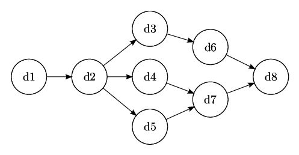

# Apache Airflow

Learning the fundamental concepts of Apache Airflow

    .
    ├── materials
    │   └── *
    ├── .gitignore
    └── README.md

➡️ Course: [Apache Airflow: The Hands-On Guide](https://www.udemy.com/course/the-ultimate-hands-on-course-to-master-apache-airflow/)

## The basics of Apache Airflow

### What is Apache Airflow?
**Apache Airflow** is an open-source platform to programmatically author, schedule, and monitor workflows.

Pros:

- It is **dynamic**, everything is done in Python.
- It is **scalable**.
- Has a **user interface**.
- It is **extensible**, so you can add plugins to it on your own.

### Core Components
- **Web server** 
    - Flask server with Gunicorn serving the UI.
- **Scheduler**
    - Daemon in charge of scheduling workflows.
- **Metastore**
    - Database where metadata is stored.
- **Executor**
    - Class defining **how** your tasks should be executed.
- **Worker**
    - Process/subprocess **executing** your task.

### What is a DAG?

**DAG** stands for **directed acyclic graph**, in other words, it is a directed graph with no loops. Here is an example:

Basically, a DAG in Apache Airflow represents a **data pipeline**. The **vertices** of a DAG represent the **tasks**, and the **directed edges** represent dependencies between the tasks.

### Operators

**Operators** are the building blocks of Airflow DAGs. They contain the logic of how data is processed in a pipeline. Each task in a DAG is defined by instantiating an operator. There are many different types of operators available in Airflow.

- **Action Operators**
    - Operators in charge of executing something.
- **Transfer Operators**
    - Operators that allow transfer data from a source to a destination.
- **Sensor Operators**
    - Operators that wait for something to happen before moving forward.

### Task instances

Apache Airflow **task instances** are defined as a representation for a specific run of a task and categorized by a collection of a DAG, a task, and a point in time.

### Workflow

A **workflow** in Apache Airflow is the combination of all the concepts we've learned about before in this README file.

### What Apache Airflow is not?

It is not a data streaming solution, nor a data processing framework. You should not process TB or GB of data in Airflow. Apache Airflow is a way to trigger external tools; it's an excellent orchestrator.

## How Airflow works?

### One Node Architecture

### Multi Nodes Architecture (Celery)

.png)